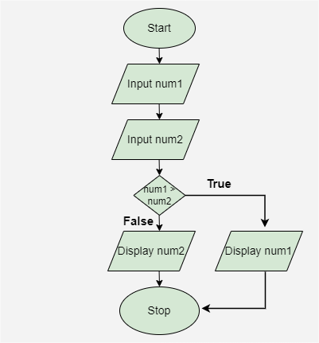

# Flowcharts in DSA

## What is a Flowchart?
A Flowchart is a graphical representation of an algorithm or process. It uses symbols and arrows to show the flow of execution step by step.
In `Data Structures and Algorithms (DSA)`, flowcharts help developers understand logic before writing actual code.

-----
## Why Use Flowcharts in DSA?
Flowcharts are useful because they:
- Simplify complex problems
- Improve logical thinking
- Help plan algorithms
- Make debugging easier
- Improve communication between developers
 They are often used before coding to visualize how a program will work.

--------

## Common Flowchart Symbols
 | Symbol | Meaning | 
 | --- | --- |
 | Oval | Start / End | 
 | Rectangle | Diamond | 
 | Process or Instruction | Decision Making | 
 | Parallelogram | Input / Output | 
 | Arrow | Flow Direction | 
 
---------
 
 ## Basic Structure of a Flowchart
```md
 Start
  ↓
Input Data
  ↓
Process Data
  ↓
Check Condition
  ↓
Display Output
  ↓
End
```
 ## Example



---------
## Flowchart in Algorithm Design
Before implementing algorithms like:
- Searching
- Sorting
- Recursion
- Tree Traversal
developers often create flowcharts to understand the execution flow clearly.

## Advantages of Flowcharts
- Easy to understand
- Visual representation of logic
- Helps detect mistakes early
- Improves documentation

## Limitations of Flowcharts
- Difficult to manage for large programs
- Time-consuming to draw
- Updating flowcharts can be hard after changes

---------

## Conclusion
Flowcharts are useful for understanding basic programming logic and designing small algorithms in DSA. They help beginners visualize how a program works step by step before writing code. However, flowcharts become difficult to manage in large and complex systems because they can grow very big and hard to update. Due to this limitation, flowcharts are rarely used in modern software industries for large-scale applications, where developers prefer pseudocode, diagrams, and direct code implementation instead.